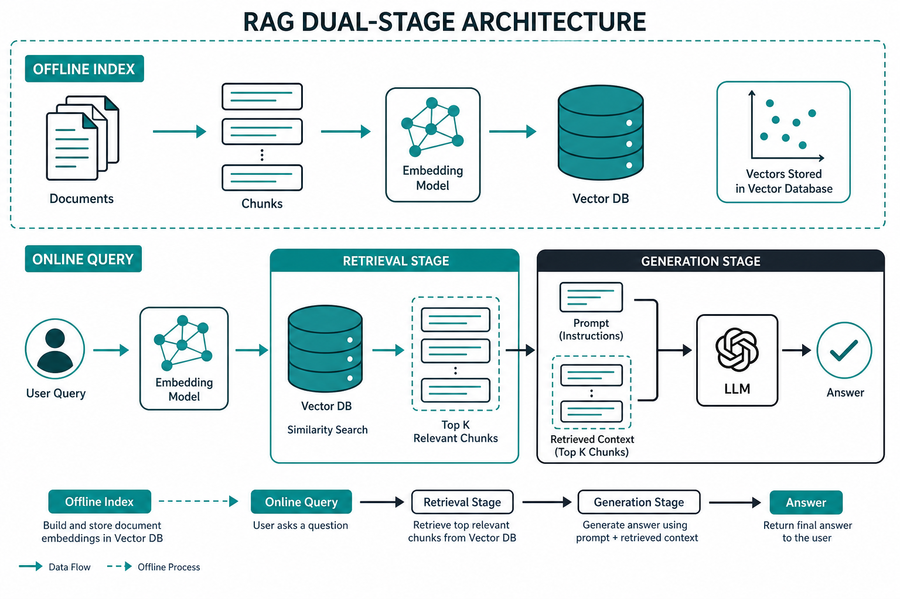
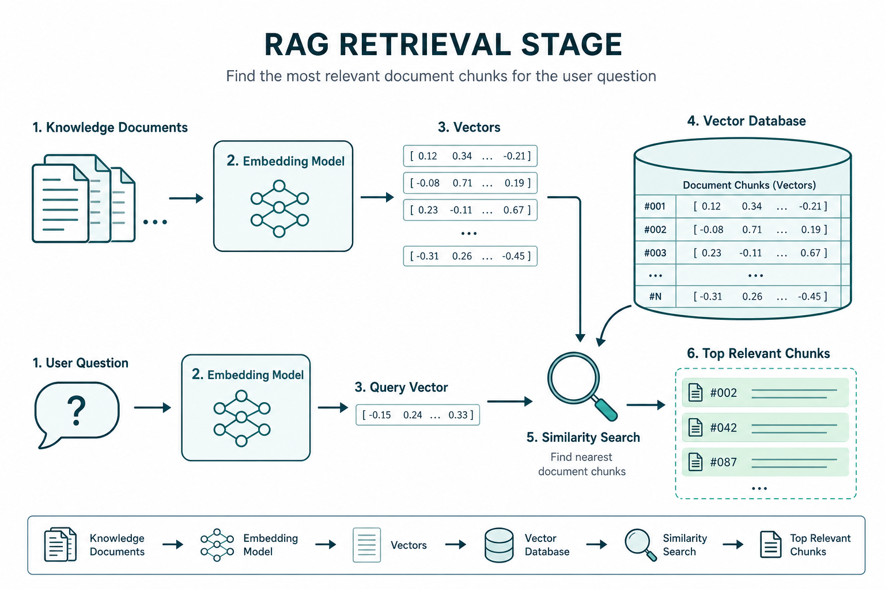
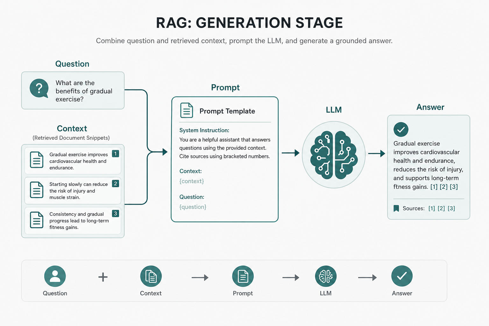

> 💡 **摘要**：RAG 可以拆成两段看——检索负责「翻到哪几页」，生成负责「对着资料怎么写答案」。理清离线索引与在线问答的分工，后面学分块、向量库、Prompt 才不会晕。

很多人听完「RAG = 先检索再生成」，还是会懵：  
嵌入模型放哪？向量库干什么？Prompt 又插在哪一步？

其实整套系统就一张图能说清：**离线把书架编好索引，在线按问题抽页，再交给大模型写作文。**



*图1｜一张图看全貌：上半截建索引，下半截检索后生成*

## 先分清两条时间线

RAG 里有两个「时钟」，别混在一起：

| 时间线 | 何时发生 | 在干什么 |
|--------|----------|----------|
| **离线（Offline）** | 用户提问之前 | 处理文档、切块、向量化、写入向量库 |
| **在线（Online）** | 用户提问之后 | 把问题向量化、相似度搜索、拼 Prompt、调用 LLM |

离线可以慢慢做、批量做；在线要快、要准。  
出了问题也要先问：是**库没建好**，还是**检索/生成这一跳坏了**。

在线路径再拆成两大阶段：

1. **检索阶段**：从知识库里找出相关片段  
2. **生成阶段**：把片段 + 问题交给大模型产出答案

## 检索阶段：先翻到对的那几页

检索阶段的目标只有一个：**把「和问题最相关」的文档片段找出来。**



*图2｜检索阶段：同一套嵌入模型，连通「文档」与「问题」*

可以按三步记：

**① 知识向量化（多半在离线完成）**  
文档先被切成小块（chunk）。**嵌入模型（Embedding）**把每一块变成一串数字——向量。这些向量连同原文，存进**向量数据库**。  
嵌入模型在这里像「翻译官」：把自然语言译成可比较距离的坐标。

**② 问题同样向量化（在线）**  
用户一提问，用**同一个**嵌入模型把问题也变成向量。  
必须同一个模型：尺子不一样，量出来的「近」就没有意义。

**③ 相似度搜索，召回 Top-K**  
在向量库里做相似度搜索（常见用余弦相似度等），取出最接近的 K 个片段。  
这 K 段，就是后面要塞进大模型的「开卷材料」。

检索阶段常见组件：

| 组件 | 作用（一句话） |
|------|----------------|
| 文档 / 切块 | 知识的原材料与粒度 |
| 嵌入模型 | 文本 ↔ 向量 |
| 向量数据库 | 存向量，并快速找近邻 |
| 相似度搜索 | 按「语义远近」排序召回 |

这一阶段答不好，后面生成再强也救不回来——给模型一堆无关资料，它只能「一本正经地胡说」。

## 生成阶段：对着资料把答案写清楚

检索交出相关片段后，轮到生成阶段：**把「问题 + 资料」编成指令，让 LLM 写出有据的回答。**



*图3｜生成阶段：Prompt 把问题和检索结果捆在一起，再交给大模型*

同样三步：

**① 上下文整合**  
把用户原问题，和检索到的若干片段放在一起，形成「本轮上下文」。

**② Prompt 指令引导**  
用预设模板约束模型，例如：

- 优先依据给定资料作答  
- 资料不足时明确说不知道  
- 必要时标出依据来自哪段  

Prompt 不是装饰，而是**生成阶段的方向盘**：同一批检索结果，提示词不同，答案风格和可信度会差一截。

**③ LLM 生成**  
大模型综合「自己的语言能力」和「你刚塞进来的资料」输出最终文本。  
理想情况下，答案应能对回检索片段，而不是凭空编造。

生成阶段常见组件：

| 组件 | 作用（一句话） |
|------|----------------|
| 检索结果（上下文） | 开卷材料 |
| Prompt 模板 | 告诉模型怎么用材料 |
| 大语言模型（LLM） | 真正写答案的引擎 |

## 两阶段怎么咬合在一起

串起来就是一条流水线：

```text
[离线] 文档 → 切块 → 嵌入 → 向量库
                ↓
[在线] 用户问题 → 嵌入 → 相似度检索 → Top-K 片段
                ↓
         问题 + 片段 + Prompt → LLM → 答案
```

用开卷考试打个比方：

- **检索** = 监考老师允许你翻书，并帮你快速定位章节  
- **生成** = 你看着这几页，按题目要求组织语言交卷  

缺检索：闭卷硬答，容易幻觉。  
缺生成：只扔一堆片段给用户，体验仍是「自己翻搜索结果」。

再记一个排障口诀：

| 现象 | 优先怀疑 |
|------|----------|
| 答非所问、张冠李戴 | 检索：切块、嵌入、召回是否不准 |
| 资料对了但仍胡说 / 不守边界 | 生成：Prompt、模型是否胡发挥 |
| 新文档永远答不上 | 离线：索引是否更新、是否入库 |

## 这篇你带走什么

1. **RAG = 离线建索引 + 在线「检索 → 生成」**，两条时间线先分清。  
2. **检索阶段**靠嵌入与向量库做语义召回，解决「翻哪几页」。  
3. **生成阶段**靠 Prompt + LLM，解决「对着资料怎么答」；两段必须咬合，缺一不可。
