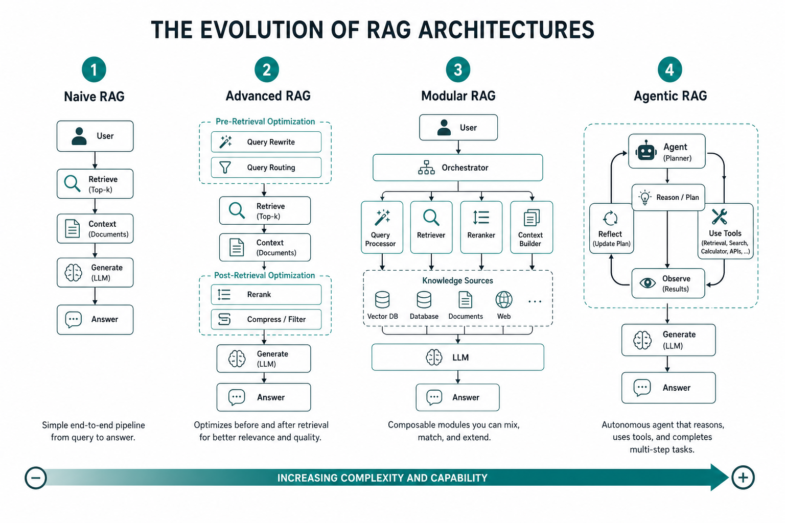
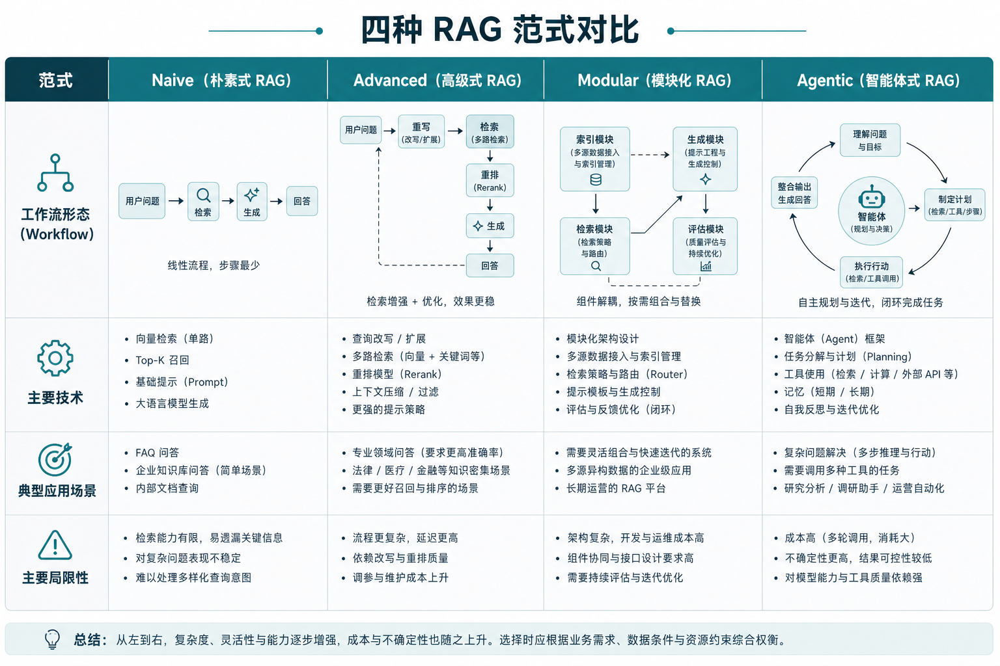
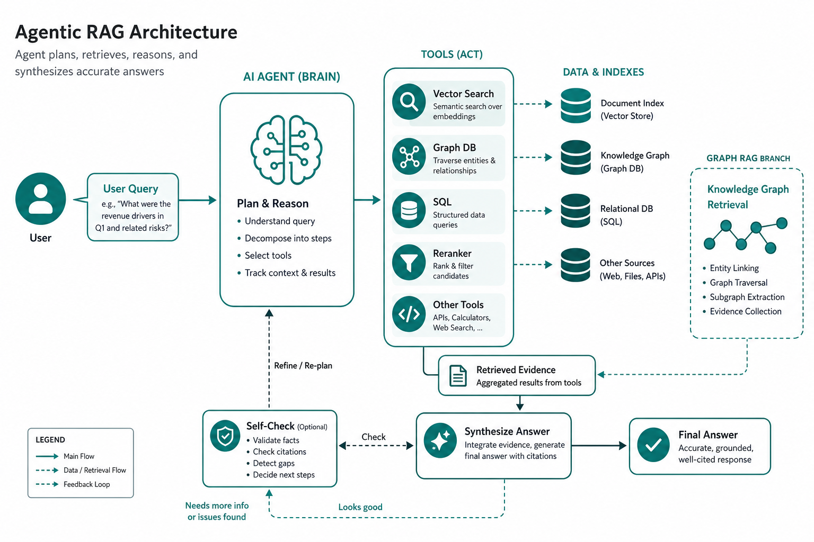

> 💡 **摘要**：RAG 已从「检索→生成」一条直线，演进到可编排的模块化流水线，再到能自主规划与调工具的 Agentic 系统。本文用四代框架梳理演进脉络，帮你判断自己该从哪一代起步、何时该升级。

你在选型会上听过这些词吗？

「我们先用 Naive RAG 跑通 MVP。」  
「生产里得加 rerank 和 query rewrite，得上 Advanced。」  
「多数据源、多策略，得 Modular 编排。」  
「2026 年了，企业助手都在讲 Agentic RAG。」

名字越来越多，容易以为 RAG 每隔半年就「换代」。其实业界主流共识是：**四代范式叠加演进**——复杂度逐级上升，但每一代都还有适用场景，不是后一代完全淘汰前一代。



*图1｜四代 RAG 演进：复杂度与自主性逐级提升*

## 为什么需要一张「演进地图」

RAG 不是单一产品，而是一套**架构思想**：把外部知识接进大模型。  
随着落地深入，大家发现：

- 只堆向量检索，效果不稳定  
- 只加长上下文，成本和幻觉压不住  
- 只换更大模型，领域知识还是进不去  

于是 RAG 在**检索前、检索后、编排方式、决策主体**四个方向不断加模块。  
学界与工业界（含 2025–2026 年 Agentic RAG 综述）目前普遍采用 **Naive → Advanced → Modular → Agentic** 四代划分；前三代在 2024 年前后已定型，第四代是当下前沿。

另有一条**并行支线 Graph RAG**：用知识图谱补关系推理，可与任意一代组合，下文单独说明。

## 四代一览



*图2｜四代范式核心差异对照*

| 范式 | 典型流程 | 核心能力 | 主要局限 |
|------|----------|----------|----------|
| **Naive RAG** | 离线索引 → 在线「检索 → 生成」 | 向量相似度召回 + LLM 生成 | 召回噪声大、难优化、易幻觉 |
| **Advanced RAG** | 检索**前/后**加优化步骤 | 查询重写、混合检索、重排、压缩 | 流程仍偏固定，模块耦合 |
| **Modular RAG** | 积木式可编排流水线 | 路由、多路融合、模块热插拔 | 设计与运维复杂度高 |
| **Agentic RAG** | Agent 自主规划检索与工具 | 多步推理、工具调用、自我修正 | 延迟与成本更高，需严格评估 |

下面逐代展开。

## 第一代：Naive RAG —— 先跑通

Naive RAG 就是最初那套「开卷考试」模板：

```text
[离线] 文档切块 → 嵌入 → 写入向量库
[在线] 用户提问 → 向量检索 Top-K → 拼 Prompt → LLM 回答
```

**优点**：实现快、概念清晰，适合 PoC 和内部 demo。  
**痛点**：切块质量、嵌入模型、Top-K 取值任一环节失手，答案就会偏；没有重排和查询优化，生产环境往往「能用但不稳」。

**适合**：知识库小、问题简单、对准确率要求不极端的场景。  
**不适合**：多数据源、复杂过滤、高事实性要求的业务。

## 第二代：Advanced RAG —— 把检索链路做细

Advanced RAG 不改变「检索 + 生成」骨架，但在**检索前**和**检索后**加优化：

**检索前（Pre-retrieval）**
- 查询重写 / 扩展（Multi-Query、HyDE 等）  
- 元数据过滤、Self-Query  
- 查询路由（走向量库还是 SQL）

**检索后（Post-retrieval）**
- 混合检索（稠密 + 稀疏 BM25）  
- 重排（RRF、Cross-Encoder、ColBERT 等）  
- 上下文压缩、去噪  

**现状**：多数**生产级文本 RAG** 落在这代——不是名字高级，而是「该加的模块都加上了」。  
2026 年流行的 **Context-engineered RAG**（更精细的分块、结构感知、上下文窗口策略）也可视为 Advanced 在数据与上下文侧的深化，而非独立第五代。

**适合**：单一或少量知识源、问答质量要明显优于 Naive、团队尚不想上多 Agent 编排。  
**局限**：流水线形态相对固定，换数据源或策略常要改整条链路。

## 第三代：Modular RAG —— 像搭乐高

Modular RAG 把 Advanced 里的步骤拆成**可替换模块**，用编排框架（LangChain、LlamaIndex、Dify 等）串起来：

- 检索器、重排器、生成器、路由器各自独立  
- 可按场景切换：客服走 FAQ 索引，制度问答走 PDF 索引  
- 支持多路召回 + 融合（Fusion）、分支与循环（检索不满意再查一轮）

**本质**：从「一条固定管道」变成「可配置的 RAG 工厂」。  
教程里常说的 **Corrective RAG（CRAG）**、**句子窗口检索** 等，都是 Modular 范式下的具体模式。

**适合**：多业务线、多数据源、需要 A/B 不同检索策略的团队。  
**代价**：模块越多，观测、评估、排障越难——没有指标体系的 Modular 容易变成「模块堆叠术」。

## 第四代：Agentic RAG —— Agent 接管决策

2025 年起，**Agentic RAG** 被多篇综述（如 Agentic RAG Survey、2026 SoK）列为当前前沿：  
系统不再按固定脚本走，而是由 **Agent** 根据问题**动态决定**：

- 要不要检索、检索几次  
- 查向量库、图数据库还是调 SQL / API  
- 是否需要分解子问题、多 Agent 协作  
- 答案是否可信，要不要自我修正（Reflection / CRAG 式校验）

常见形态包括：**单 Agent 路由型**、**多 Agent 分工型**、**层级 Agent**、**Graph-Based Agentic RAG** 等。



*图3｜第四代：Agent 作为「调度中枢」，按需调用检索与工具*

**优点**：复杂、多跳、跨源问题表现更好；更接近「AI 助手」而非「搜索 + 总结」。  
**风险**：调用链变长 → 延迟、成本、错误累积上升；必须有评估与护栏（RAGAS、TruLens 等），否则 Agent 会「自信地走错路」。

**适合**：企业智能助手、复杂分析问答、需多工具协同的场景。  
**不适合**：强实时、低延迟、问题极简单的 FAQ——杀鸡不必用 Agent。

## 并行支线：Graph RAG 算第几代？

**Graph RAG 不是取代上述四代的「第五代」**，而是把**知识图谱**引入检索：

- 向量检索擅语义相似，弱于实体关系与多跳推理  
- 图谱显式存「谁收购谁、哪道菜用哪些食材」等关系  
- 可与 Naive / Advanced / Modular / Agentic **任意组合**

微软 GraphRAG、LightRAG 等属于这条支线的产品化探索。  
若你的问题常涉及「A 和 B 什么关系、沿链路推三步」，Graph 增强值得单独规划，而不是硬塞进纯向量 Naive 管线。

## 怎么选：别追新，追匹配

| 你的情况 | 建议起点 |
|----------|----------|
| 刚验证想法、文档 < 1000 页 | Naive → 快速验证 |
| 要上生产、问答质量不稳定 | Advanced（混合检索 + 重排 + 查询优化） |
| 多数据源 / 多策略 / 持续迭代 | Modular 编排 |
| 复杂推理、多工具、企业 Agent | Agentic，并配套评估与监控 |
| 关系型、多跳问题突出 | 在以上任一代基础上 + Graph RAG |

**务实原则**：  
1. 能 Naive 解决的不急着 Advanced；Advanced 稳了再 Modular；Agentic 是能力需求驱动，不是年份驱动。  
2. 每一代的上限，往往卡在**数据质量与评估**，而不是少了一个时髦名词。  
3. 长上下文模型很强，但**按需检索 + 可更新知识库**仍是企业知识场景的主线——四代演进是在这条主线上叠能力，不是被长上下文取代。

## 这篇你带走什么

1. **主流演进是四代**：Naive → Advanced → Modular → Agentic，复杂度与自主性递增。  
2. **Advanced 是当前生产主力**；Modular 解决「可编排」；Agentic 解决「复杂决策与多工具」。  
3. **Graph RAG 是增强支线**，可与四代任意组合；选型看问题形态，不追名词最新。
