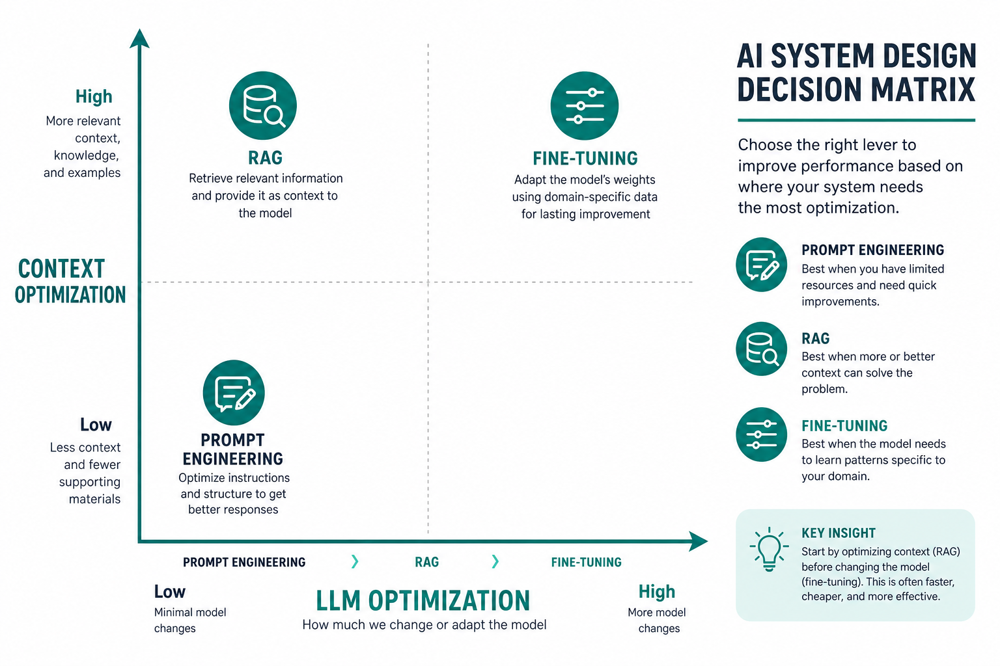
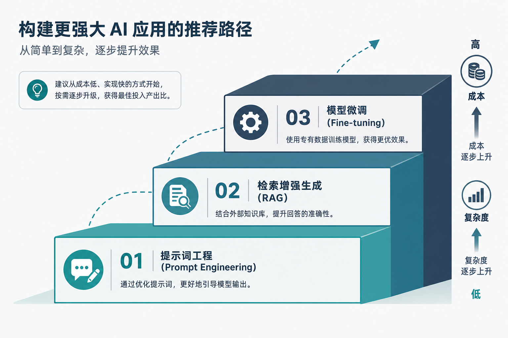
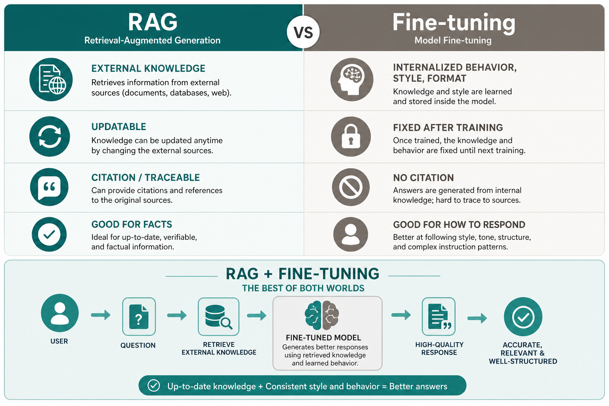

> 💡 **摘要**：RAG 解决「知道什么」，微调解决「怎么说、怎么答」。多数团队应优先 Prompt → RAG，再在行为/格式固化需求出现时考虑微调；二者也可组合。本文用一张选型表和决策路径，帮你少踩「一上来就微调」的坑。

立项会上最容易吵起来的一个问题：

「知识库问答，我们微调一个垂直模型，是不是一劳永逸？」  
「文档每周都在变，微调完又过时了吧？」  
「RAG 检索不准，是不是该直接 SFT？」

这三句话里，混着两种完全不同的需求：**补知识** 和 **改行为**。  
选错路径，轻则烧钱，重则系统越调越难维护。

*图1｜横轴看「改模型有多深」，纵轴看「给模型的上下文有多丰富」*

## 先记一句分工

| | **RAG** | **微调（Fine-tuning）** |
|---|---------|-------------------------|
| **主要改什么** | 输入给模型的**外部上下文** | 模型**权重里的行为与模式** |
| **典型目标** | 让模型**知道**最新、私有、可溯源的事实 | 让模型**学会**固定格式、语气、复杂指令、领域话术 |
| **知识更新** | 换文档 / 重建索引即可，**热更新** | 需重新训练或增量训练，**成本高、周期长** |
| **可解释性** | 可引用检索片段，**有据可查** | 知识「融」进参数，**难逐条溯源** |
| **对模型改动** | **不改**权重 | **改**权重（全量或 LoRA 等） |

一句话：**RAG 管「开什么卷」，微调管「怎么答题」。**

## 推荐路径：先便宜后贵

业界常见共识是，按**对模型改动从小到大**依次尝试：

*图2｜优先选改动小、成本低的方案；不够再升级*

**① Prompt 工程**  
改提示词、加 few-shot 示例、约束输出格式。  
适合：模型**本来就会**，只是问法或格式不对。  
成本最低，应先做满。

**② RAG**  
外挂知识库，检索后再生成。  
适合：模型**不知道**——私有文档、实时政策、产品手册、内部 Wiki 等。  
知识会变、要溯源、要控幻觉时，RAG 通常是首选。

**③ 微调**  
用标注数据调整模型参数（全量微调或 LoRA/QLoRA 等参数高效方法）。  
适合：要改的是**怎么做**，而不是**知道什么**——例如：  
- 固定 JSON / 表格输出 schema  
- 统一客服话术、品牌语气  
- 把极长、极复杂的指令「蒸馏」进模型  
- 特定任务上稳定优于通用 Prompt 的表现  

**不要跳过前两步直接微调。** 很多「答不对」其实是检索或 Prompt 问题，微调救不了过时的知识，反而把错误固化进权重。

## 一张选型表说清（核心）

按**你的真实需求**对号入座：

| 需求场景 | 更合适的方案 | 简要理由 |
|----------|--------------|----------|
| 回答依赖**最新**文档 / 政策 / 价格 | **RAG** | 知识库可频繁更新，无需重训 |
| 回答必须**引用出处**、可审计 | **RAG** | 检索片段可展示给用户或合规 |
| 数据**敏感**，不能进公有云训练 | **RAG**（本地库） | 知识留在库内，模型只读上下文 |
| 领域**事实型**问答（是什么、多少、哪条） | **RAG** | 事实以外部资料为准 |
| 统一**输出格式**（严格 JSON、固定字段） | **微调** 或 Prompt+解析 | 行为模式适合写进权重 |
| 固定**说话风格** / 角色人设 | **微调** | 风格稳定，少靠每次 Prompt |
| 复杂**指令遵循**（多步、多约束） | **微调** | 减少 Prompt 长度与漂移 |
| 检索已很准，仍**不守规矩、爱发挥** | **微调**（或 RAG+微调） | 约束生成行为 |
| 既要**私有知识**又要**固定格式/语气** | **RAG + 微调** | 知识走库，行为走权重 |
| 问题简单，通用模型**本来就能答** | **Prompt** 即可 | 不必过度工程 |

## RAG 特别擅长的四类问题

| 问题 | RAG 怎么帮 |
|------|------------|
| 静态知识局限 | 实时检索外部库，支持动态更新 |
| 幻觉 | 基于检索内容生成，错误率通常更低 |
| 领域专业不足 | 挂领域知识库（医疗、法律、内部制度等） |
| 数据隐私 | 知识库本地部署，敏感数据不进训练集 |

若你的痛点 primarily 在上表四行，**先 RAG，别急着微调**。

## 微调真正该上的时机

满足**多条**时再认真评估微调：

1. Prompt + RAG 已优化到位，**行为**仍不达标（格式、语气、拒答策略）  
2. 有**足够高质量标注数据**，且任务相对固定  
3. 能接受**训练与迭代成本**（算力、标注、版本管理）  
4. 知识更新频率**低于**行为调整频率——或知识仍走 RAG，只微调「怎么说」  

微调**不适合**当「万能知识注入器」：  
- 文档天天变 → 微调追不上  
- 没有评估集 → 不知道训好了没有  
- 检索层一塌糊涂 → 微调后的模型照样会对着错误上下文发挥  

## 组合拳：RAG + 微调

生产里很常见：

- **RAG**：提供最新、可溯源的事实上下文  
- **微调**：让模型更稳地「只根据上下文答、按公司格式答」  

这不是二选一，而是**分工协作**。  
例如：客服助手用 RAG 拉产品文档，用 LoRA 微调统一回复结构与礼貌用语。

*图3｜左：补知识；右：改行为；底部：RAG + 微调 组合*

## 快速决策（30 秒版）

在心里回答三个问题：

1. **主要是「不知道」还是「知道但答不对味」？**  
   - 不知道 → RAG（或先 Prompt）  
   - 不对味 → 微调或 Prompt  

2. **知识会不会频繁变？**  
   - 会变 → 优先 RAG  
   - 很少变、且要内化 → 才考虑把知识放进微调（仍要评估是否值得）  

3. **要不要引用原文、做合规审计？**  
   - 要 → RAG  
   - 不要、只要风格一致 → 微调  

## 这篇你带走什么

1. **RAG = 改上下文、补知识；微调 = 改权重、塑行为**——先分清「知道什么」和「怎么说」。  
2. **默认路径：Prompt → RAG → 微调**，改动越小越优先。  
3. **文档常变、要溯源 → RAG；格式语气要锁死 → 微调；两者都要 → 组合。**
