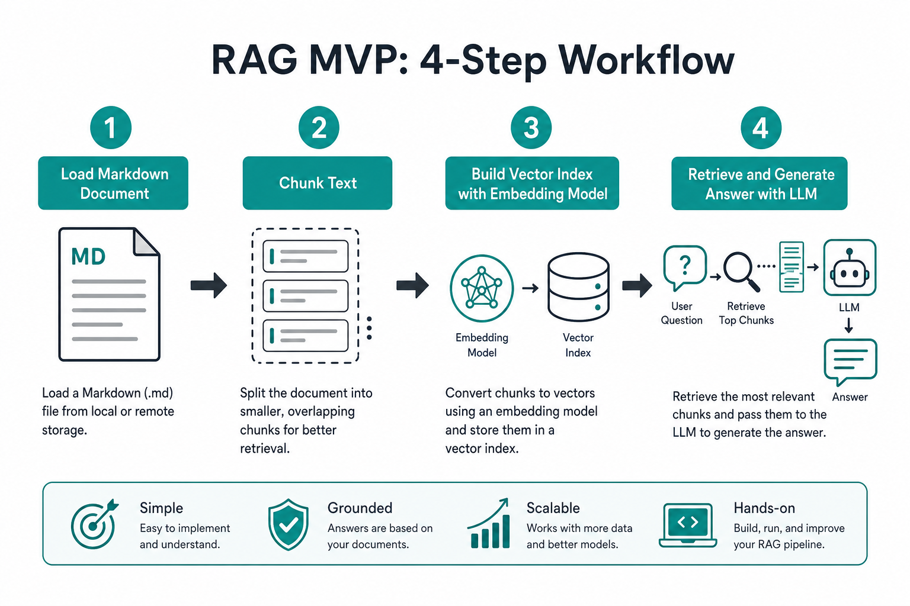
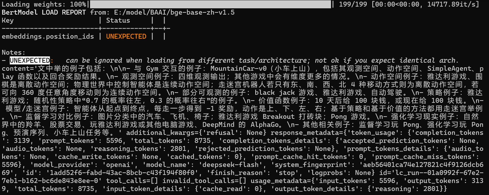
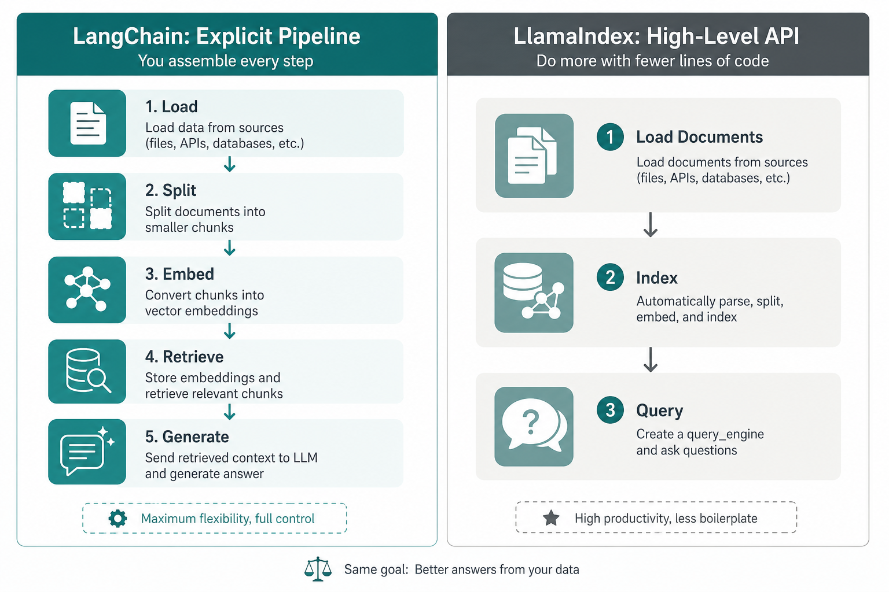

> 💡 **摘要**：用一份本地 Markdown 文档 + LangChain，30 分钟内跑通「加载 → 分块 → 建索引 → 检索 → 生成」完整闭环。文末附 LlamaIndex 极简写法与常见报错处理。

概念看再多，不如自己跑通一次。

这篇带你完成第一个能答问的 RAG 小应用：  

四步 MVP：加载、分块、索引、检索生成



*图1｜最小 RAG 闭环：四步对应四段代码*

## 开始前准备

**环境**

- Python 3.12，已创建并激活 Conda 环境（如：llm-env）
- 项目依赖已安装

**API Key**

- 在环境变量或 `.env` 中配置 `DEEPSEEK_API_KEY`（或你使用的兼容 OpenAI 格式的 LLM 密钥）

**嵌入模型**

- 首次运行会下载 `BAAI/bge-small-zh-v1.5`（中文嵌入），也可以直接指定本地路径。
- 国内若 HuggingFace 慢，可在代码里取消注释：`os.environ['HF_ENDPOINT'] = 'https://hf-mirror.com'`

## 第一步：进目录，直接跑

在仓库根目录打开终端：

```bash
conda activate llm-env
python ask.py
```



**成功标志**：终端打印一大段对象，其中 `content` 字段里列出强化学习章节中的多个例子（羚羊、股票、雅达利游戏等）。那就是 LLM 根据**检索到的上下文**生成的回答。

## 脚本在干什么（对应四步 MVP）

在 `ask.py` 代码中，逻辑可以拆成四块——和「检索 + 生成」一一对应。

### 1. 数据准备：加载 + 分块

```python
import os
from langchain_unstructured import UnstructuredLoader
from langchain_text_splitters import RecursiveCharacterTextSplitter
from langchain_huggingface import HuggingFaceEmbeddings
from langchain_core.vectorstores import InMemoryVectorStore
from langchain_core.prompts import ChatPromptTemplate
from langchain_openai import ChatOpenAI

### 1. 加载本地markdown文件
markdown_path = "code/markdown.md"
loader = UnstructuredLoader(markdown_path)
docs = loader.load()

# 文本分块
text_splitter = RecursiveCharacterTextSplitter()
chunks = text_splitter.split_documents(docs)
```

- **加载**：把 Markdown 读进内存  
- **分块**：长文切成较小 chunk，方便嵌入和检索（默认按段落/句子递归切，带一定重叠）

### 2. 索引构建：嵌入 + 向量库

```python
# 当前也可提前下载，将 model_name 传入绝对路径
embeddings = HuggingFaceEmbeddings(
    model_name="BAAI/bge-small-zh-v1.5",
    model_kwargs={"device": "cpu"},
    encode_kwargs={"normalize_embeddings": True},
)
vectorstore = InMemoryVectorStore(embeddings)
vectorstore.add_documents(chunks)
```

每个 chunk 变成向量，存入**内存向量库**（示例用 `InMemoryVectorStore`，适合本地试跑）。

### 3. 检索：按问题找 Top-K

```python
question = "文中举了哪些例子？"
retrieved_docs = vectorstore.similarity_search(question, k=3)
docs_content = "\n\n".join(doc.page_content for doc in retrieved_docs)
```

用**同一个**嵌入模型把问题向量化，在库里找最相似的 3 段，拼成上下文。

### 4. 生成：Prompt + LLM

```python
prompt = ChatPromptTemplate.from_template("""请根据下面提供的上下文信息来回答问题。
请确保你的回答完全基于这些上下文。
如果上下文中没有足够的信息来回答问题，请直接告知：“抱歉，我无法根据提供的上下文找到相关信息来回答此问题。”

上下文:
{context}

问题: {question}

回答:""")

llm = ChatOpenAI(
    model="deepseek-v4-flash",
    temperature=0.4,
    api_key=os.getenv("DEEPSEEK_API_KEY"),
    base_url="https://api.deepseek.com",
)

answer = llm.invoke(prompt.format(question=question, context=docs_content))
print(answer)
```

Prompt 明确要求**只依据上下文**作答，减少胡编。

## 输出里看什么

LangChain 返回的往往是一个**消息对象**，不只是纯文本：


| 字段                              | 含义          |
| ------------------------------- | ----------- |
| `content`                       | 你要的答案正文     |
| `response_metadata.token_usage` | 本次消耗的 token |
| `response_metadata.model_name`  | 实际调用的模型名    |
| `finish_reason: stop`           | 正常结束生成      |


若只要正文，可改为：

```python
print(answer.content)
```

## 换 LlamaIndex：更少代码的写法

同一仓库 `ask2.py` 用 LlamaIndex 把分块、索引、检索、生成**封装**在一起：

```python
import os
from llama_index.core import VectorStoreIndex, SimpleDirectoryReader, Settings
from llama_index.llms.openai_like import OpenAILike
from llama_index.embeddings.huggingface import HuggingFaceEmbedding

Settings.llm = OpenAILike(
    model="deepseek-v4-flash",
    api_key=os.getenv("DEEPSEEK_API_KEY"),
    api_base="https://api.deepseek.com",
    is_chat_model=True,
)
Settings.embed_model = HuggingFaceEmbedding("BAAI/bge-small-zh-v1.5")

documents = SimpleDirectoryReader(input_files=["markdown.md"]).load_data()

index = VectorStoreIndex.from_documents(documents)
query_engine = index.as_query_engine()

print(query_engine.query("文中举了哪些例子?"))
```

LangChain 显式流水线 vs LlamaIndex 高层 API



*图3｜左：步骤清晰、便于改；右：代码短、上手快*

- **LangChain**：每一步显式，适合理解原理、后续加混合检索/重排  
- **LlamaIndex**：`from_documents` + `query`，适合快速验证想法

建议**先跑 LangChain 版**弄清数据流，再试 LlamaIndex 版对比体验。

## 常见问题（跑不通时看这里）

| 现象            | 处理                                                                  |
| ------------- | ------------------------------------------------------------------- |
| 嵌入模型下载失败 / 极慢 | 设置 `HF_ENDPOINT` 镜像；或提前把 `bge-small-zh-v1.5` 下到本地并改 `model_name` 路径 |
| API 401 / 403 | 检查 Key 是否正确、余额是否充足                                                  |
| 答案明显胡编        | 看检索到的 3 段是否相关；可改 `question` 或调 `k`、分块参数做对比                          |
| 输出一堆 metadata | 使用 `print(answer.content)` 只打印正文                                    |


**小实验**（加深理解）：

1. 把 `chunk_size` / `chunk_overlap` 改小或改大，看召回例子是否更全或更碎
2. 把 `k=3` 改成 `k=1` 或 `k=5`，观察答案变化
3. 问一个文档里**没有**的问题，看模型是否按 Prompt 拒答

## 这篇你带走什么

1. **最小 RAG = 加载分块 → 嵌入建库 → 相似度检索 → Prompt 生成**，一条命令就能在 `code/C1` 跑通。
2. 成功时重点看输出里的 `content`，那就是「开卷」后的答案。
3. LangChain 练流程，LlamaIndex 练效率；下一步可以换自己的 Markdown 路径，问第一个属于你自己的问题。

