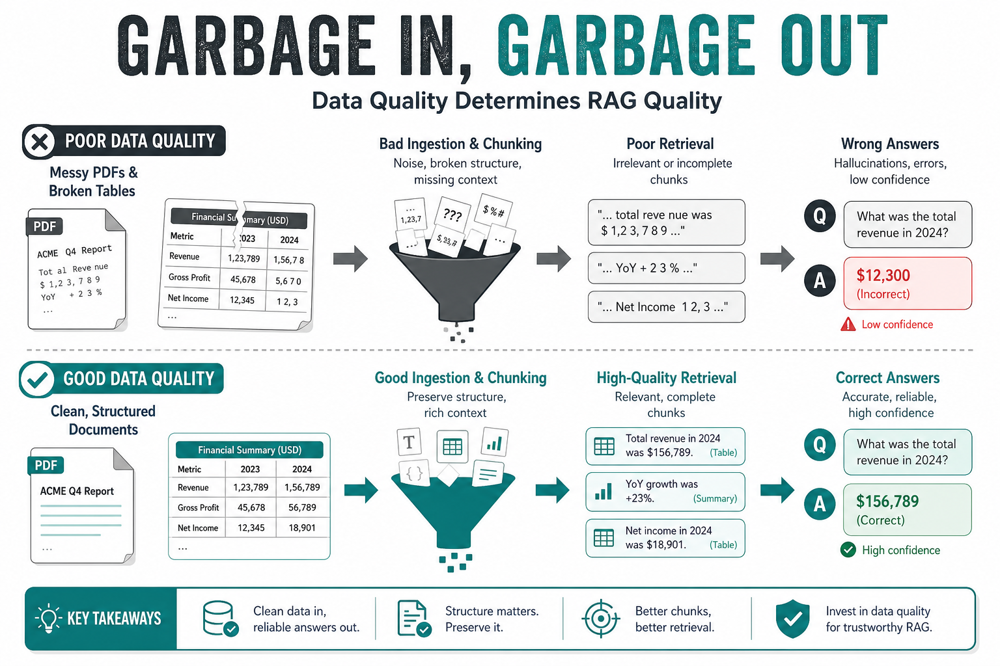
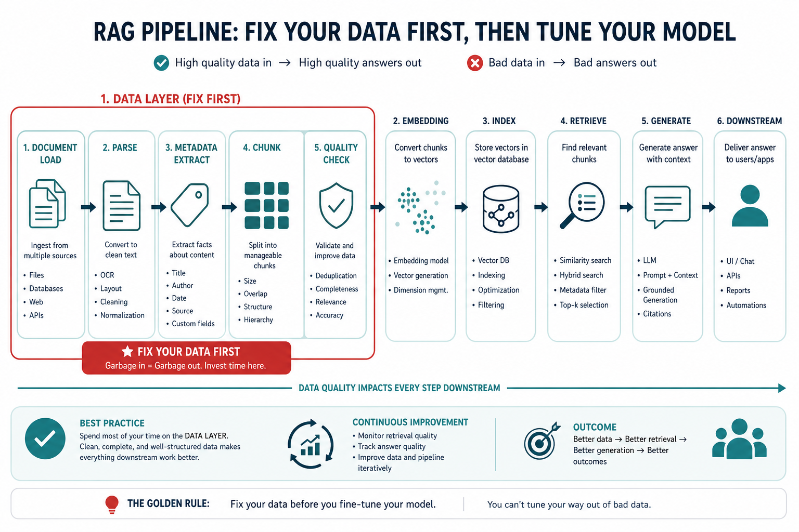
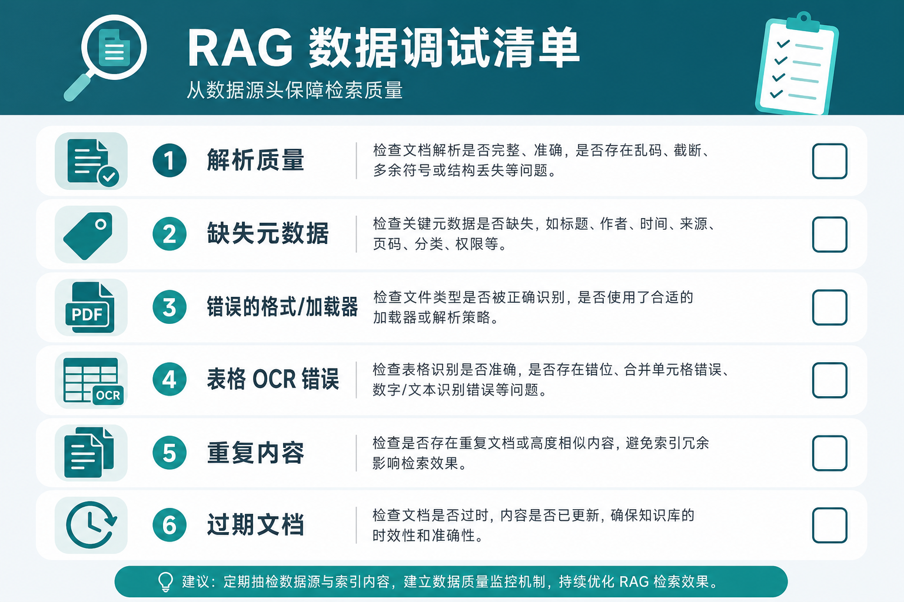

> 💡 **摘要**：RAG 答不好，十有八九是「资料没进好库」——解析乱、元数据缺、语料脏，后面换再大模型也救不回来。本文用 Garbage In, Garbage Out 说清数据层为什么是排障第一站，并给你一份可照着查的清单。

上线两周，老板问：「我们换了更强的模型，为什么还是答错？」

团队第一反应往往是：再调 Prompt、加重排、换 embedding、上 Agent。  
但打开向量库里的原始 chunk 一看——**PDF 表格挤成一行、页眉页脚和正文粘在一起、旧版制度和新版混在一起**。

这不是模型笨，是**喂进去的数据就错了**。  
数据工程里老话说：**Garbage In, Garbage Out（垃圾进，垃圾出）**。RAG 把这句话放大了一万倍：检索到的每一小段，都是生成时的「唯一依据」。


*图1｜左边进的是乱资料，右边出来的只能是乱答案*

## 为什么「先查数据」比「先换模型」划算

RAG 的因果链很长：

```text
原始文档 → 加载解析 → 清洗分块 → 嵌入入库 → 检索 → 生成
```

**前半段全是数据工程**；模型只在最后一环出场。  
前面任何一步出错，后面都在「用错误的上下文做正确的生成」——模型越聪明，越会**把错误说得像真的**。

| 常见误区             | 实际更可能的原因            |
| ---------------- | ------------------- |
| 「换 GPT-4 就好了」    | PDF 解析丢字，库里根本没有正确答案 |
| 「embedding 模型太弱」 | 块太大、主题混杂，向量语义被稀释    |
| 「Prompt 不够严」     | 检索召回了页眉、免责声明、过期文档   |
| 「要多做几轮微调」        | 该更新的文档没入库，权重里仍是旧知识  |

**先查数据**，指的是：在动模型之前，先确认**进库的文字是否完整、干净、可检索、带对元数据**。


*图2｜排障顺序：先加载与语料，再索引与检索，最后才是模型*

## 数据层到底在干什么

RAG 里的「数据准备」，不只是「读个文件」。文档加载器通常要完成三件事：

1. **解析**：PDF / Word / HTML / Markdown → 可处理的纯文本（含表格、标题结构）
2. **抽元数据**：来源、页码、章节、日期、文档类型等
3. **统一结构**：变成框架能切分、能向量化的 `Document` 对象

这和传统 ETL（抽取、转换、加载）是一类活：**把杂乱资料对齐成标准语料**。  
加载器选错（例如扫描版 PDF 当纯文本硬读），后面所有「高级 RAG」都是在垃圾上雕花。

## 六类「数据病」，对号入座


*图3｜上线前 / 效果变差时，先过一遍这张清单*

| 症状            | 可能的数据层原因              | 怎么快速验证                     |
| ------------- | --------------------- | -------------------------- |
| 明明文档里有，就是检索不到 | 解析丢内容（表格/双栏 PDF）、块被截断 | 随机抽 10 个 chunk 人工读一遍       |
| 答案张冠李戴        | 页眉页脚、目录、水印进块          | 看召回片段是否像「正文」               |
| 同一问题有时对有时错    | 新旧版本文档混库、重复 chunk     | 查元数据里的 `source`、日期         |
| 数字、条款总错       | 表格解析成乱序一行             | 对比原 PDF 与 chunk 中表格        |
| 过滤条件不生效       | 元数据没抽或字段名不对           | 看 `metadata` 是否为空          |
| 中文乱码、英文断词     | 编码或 loader 不匹配        | 单独 load 一份看 `page_content` |


**验证方法很简单**：别只看最终答案，**直接打印** `similarity_search` **返回的 Top-K 原文**。  
若 Top-K 里就没有正确答案，问题在数据或检索；若 Top-K 对了、答案仍错，再查 Prompt 和模型。

## 加载器选型：不是越贵越好，是越「贴格式」越好

不同文档形态，要用不同解析能力。教程里常见的方向包括：

| 场景               | 更合适的思路                                 |
| ---------------- | -------------------------------------- |
| 纯 Markdown / TXT | 轻量 Loader 即可                           |
| 复杂 PDF（论文、合同）    | PyMuPDF4LLM、Marker、LlamaParse、MinerU 等 |
| 多格式企业文档库         | Unstructured、Docling                   |
| 网页 / 在线文档        | FireCrawl 等抓取 + 清洗                     |

**选型原则**：拿**最难的 3 份真实 PDF** 做解析对比，看标题、表格、列表是否保留；通过再谈入库。  
省下的 API 费用，往往抵得过后面 weeks 的检索调参。

## 一个 30 分钟的「数据体检」流程

不必上完整评估框架，先做最小体检：

1. 从向量库（或分块结果）随机抽 20 个 chunk，标成：可读正文 / 噪音 / 损坏  
2. 挑 5 个业务里真实答错的问题，打印 Top-5 原文  
3. 对每个坏 case 只问一句：**正确答案当时在不在 Top-5 里？**  
   - 不在 → 数据或检索  
   - 在 → Prompt / 模型 / 上下文拼装  

很多团队第一次做完，会发现「模型问题」里有一半以上其实是第 1、2 步就能看见的脏数据。

## 和「分块」的关系（先有个概念）

加载之后还有**分块**：块太大 → 语义稀释、检索不精；块太乱 → 多主题挤一块，区分不清楚。  
这些也属于**数据准备**，同样要在换模型之前排查。  
排障顺序不变：**先确认 chunk 里写的是人话、是正文、是现行版本**，再谈切多大、怎么切。

## 团队可执行的排障顺序

1. **看原始 chunk**：随机抽样 + 针对 bad case 的 query 看 Top-K
2. **看解析链路**：换 loader / 开 OCR / 修表格，直到抽样过关
3. **看元数据**：来源、时间、类型是否齐全，过滤是否生效
4. **再调检索**：混合检索、重排、query 改写
5. **最后动生成**：Prompt、模型、格式约束

跳过 1–3 直接调 5，是 RAG 项目里最常见的浪费。

## 这篇你带走什么

1. **RAG 效果差，先怀疑数据**：解析、元数据、语料新鲜度，比换模型便宜得多。
2. **Garbage In, Garbage Out**：检索到的 chunk 就是模型的「世界」，脏块必脏答。
3. **用 Top-K 原文做体检**：召回里没有答案，就别急着怪 LLM；先修加载与语料。

